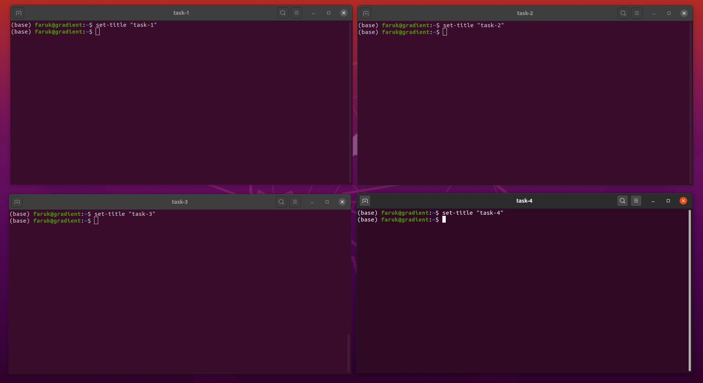

# How to set title to your ubuntu terminal for specific task?

## Why needed?
Why do you need to set title to your terminal window? 

Let me explain briefly.

If you are working on multiple tasks, and need to check progress of the running task after a while, then setting up terminal window title will help you to easily switch between terminal windows. 

Another use cases might be, if you are trying to train multipel machine learning models with different paremeters for same task, then setting up temrinal window title will help you to distinguish between which window is running which instance of your training task. Otherwise, after a few epochs are run, it will be difficult to understand which experiment is running in which window.

So, let's see, how you can set window title with few lines of code-

## Steps Required

### Step#1
Open ```.bashrc``` file with any text editor.
```bash
sudo nano ~/.bashrc
```

### Step#2
Add the following function at the bottom of the ```.bashrc``` content. We are going to tweak with ```PS1``` for setting window title.

Copy the bellow code & paste in ```.bashrc``` file-
```bash
function set-title() {
  if [[ -z "$ORIG" ]]; then
    ORIG=$PS1
  fi
  TITLE="\[\e]2;$*\a\]"
  PS1=${ORIG}${TITLE}
}
```

Save & exit the text editor.

### Step#3
Reload the ```.bashrc``` profile by running the following command-
```bash
source ~/.bashrc
```

### Step4
Now to set a title to a terminal window, run the following command-
```bash
set-title "Window Title You Want to Set"
```
You will see the given title in the terminal window like the bellow image-




**N.B. This approach is tested in Gnome environment. Might not work in other systems. Please check your system environment before running this task.**

